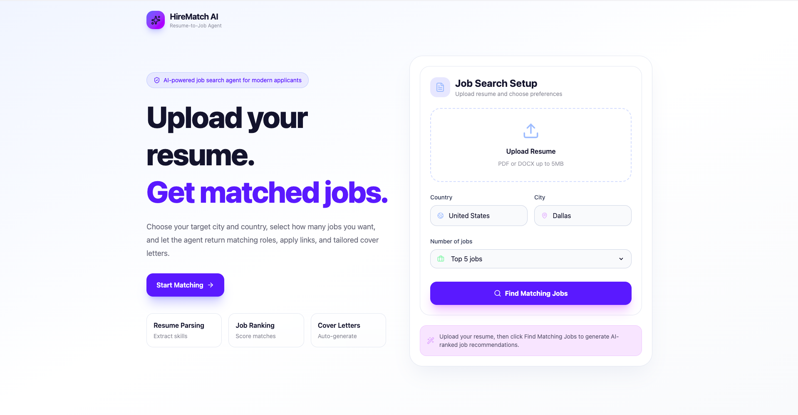

# HireMatch AI

AI-powered Resume-to-Job Matching Agent built with React, Node.js, Gemini API, and JSearch API.

## Features

- Resume upload and parsing
- AI profile extraction
- Skills, certifications, and target role detection
- Real job search by country and city
- AI-ranked job recommendations
- Direct apply links
- Tailored cover letter generation
- Copy cover letter button
- Modern SaaS-style UI

## Screenshot

## Tech Stack

- React
- Tailwind CSS
- Node.js
- Express.js
- Gemini API
- JSearch API